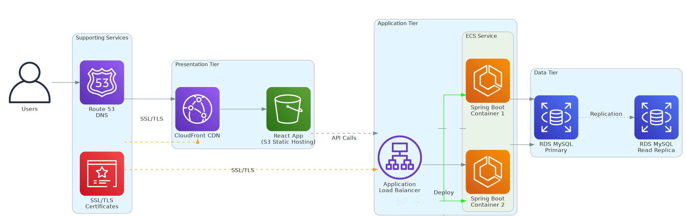
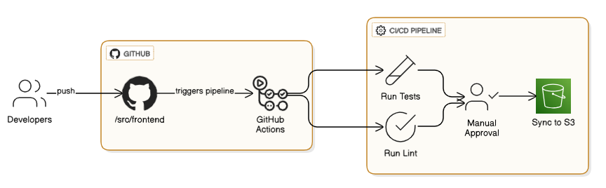
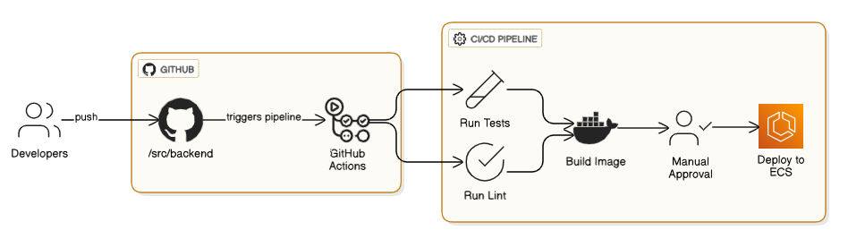

# Three-Tier DevOps AWS Project
[](https://github.com/HasanAshab/three-tier-devops-aws/actions/workflows/frontend-cicd.yaml)
[](https://github.com/HasanAshab/three-tier-devops-aws/actions/workflows/backend-cicd.yaml)

A comprehensive DevOps implementation showcasing modern cloud infrastructure, CI/CD pipelines, and Infrastructure as Code (IaC) practices for a three-tier web application on AWS.

## 🎯 Project Overview


This project demonstrates enterprise-grade DevOps practices by implementing a complete cloud infrastructure and deployment pipeline for a three-tier web application. While the application code (React frontend and Spring Boot backend) is sourced from the open-source community, **all DevOps engineering, infrastructure design, and automation is original work**.

### What I Built

- **Complete AWS Infrastructure** - Terraform modules for scalable, secure cloud architecture
- **CI/CD Pipelines** - Automated testing, building, and deployment workflows
- **Infrastructure as Code** - Modular, reusable Terraform configurations
- **Security & Compliance** - Best practices for cloud security and monitoring
- **Multi-Environment Support** - Dev/staging/production environment management

## 🏗️ Architecture



### Infrastructure Components

- **Frontend Tier**: React SPA served via CloudFront CDN + S3
- **Backend Tier**: Spring Boot API on ECS Fargate with Application Load Balancer
- **Data Tier**: MySQL RDS with automated backups and scaling
- **Networking**: VPC with public/private subnets across multiple AZs
- **Security**: SSL/TLS encryption, security groups, and IAM roles
- **DNS**: Route 53 hosted zone with custom domain management

Read more about the architecture and design choices in the [Infrastructure as Code](infra/README.md) section.

## 🚀 DevOps Features

### Infrastructure as Code
```
infra/
├── modules/           # Reusable Terraform modules
│   ├── network/      # VPC, subnets, NAT gateway
│   ├── frontend/     # S3, CloudFront, ACM certificates
│   ├── backend/      # ECS, ALB, security groups
│   ├── db/          # RDS MySQL with security
│   └── domain/      # Route 53, SSL certificates
├── envs/            # Environment-specific configurations
├── bin/             # Deployment and utility scripts
└── tests/           # Infrastructure testing
```

### CI/CD Pipeline
Frontend:


Backend:


#### Continuous Deployment

**Frontend CD**: Automated deployment pipeline that uploads build artifacts to S3 (requires manual approval) on successful push to the main branch from `/src/frontend`. The React application is built, optimized, and deployed to S3, then distributed globally via CloudFront CDN. Requires manual approval for production deployment.

**Backend CD**: Automated deployment pipeline that deploys containerized Spring Boot application to ECS Fargate (requires manual approval) on every successful push to the main branch from `/src/backend`. Uses rolling updates for zero-downtime deployments with health checks and automatic rollback capabilities.


### Key DevOps Practices

✅ **Infrastructure as Code** - 100% Terraform-managed infrastructure  
✅ **GitOps Workflow** - Git-based infrastructure and deployment management  
✅ **Multi-Environment** - Separate dev/staging/production environments  
✅ **Security First** - SSL/TLS, security groups, least privilege access  
✅ **Monitoring & Logging** - CloudWatch integration and alerting  
✅ **Cost Optimization** - Spot instances, autoscaling, resource tagging  
✅ **Disaster Recovery** - Multi-AZ deployment, automated backups  

## 🛠️ Technology Stack

### DevOps & Infrastructure
- **Cloud Platform**: AWS
- **Infrastructure as Code**: Terraform
- **CI/CD**: GitHub Actions
- **Containerization**: Docker, ECS Fargate
- **Monitoring**: CloudWatch
- **Security**: AWS IAM, Security Groups, ACM

### Application Stack (Community Source)
- **Frontend**: React, TypeScript
- **Backend**: Spring Boot, Java
- **Database**: MySQL
- **Development**: Docker Compose

## 📋 Prerequisites

- AWS CLI configured with appropriate permissions
- Terraform >= 1.10.0
- Docker and Docker Compose
- Node.js and npm (for local development)
- Java 17+ and Maven (for local development)

## 🚀 Quick Start

### Local Development

```bash
# Navigate to source directory
cd src

# Start all services with Docker Compose
docker-compose up -d

# Access the application
# Frontend: http://localhost:4200
# Backend API: http://localhost:8080
# Database: localhost:3306
```

## 📁 Project Structure

```
├── .github/workflows/     # CI/CD pipeline definitions
├── infra/                # Infrastructure as Code
│   ├── modules/          # Reusable Terraform modules
│   ├── envs/            # Environment configurations
│   ├── bin/             # Deployment scripts
│   └── tests/           # Infrastructure tests
├── src/                 # Application source code
│   ├── frontend/        # React application (community source)
│   ├── backend/         # Spring Boot API (community source)
│   └── db/             # Database configurations
└── static/             # Documentation assets
```

## 🤝 Contributing

This project focuses on DevOps practices and infrastructure. Contributions welcome for:

- Infrastructure improvements and optimizations
- CI/CD pipeline enhancements
- Security and compliance features
- Documentation and best practices


## 🙏 Acknowledgments

- **Application Code**: Frontend (React) and Backend (Spring Boot) applications are sourced from the open-source community
- **DevOps Implementation**: All infrastructure, CI/CD, and deployment automation is original work
- **AWS Community**: For excellent documentation and best practices

## 📞 Contact

For questions about the DevOps implementation, infrastructure design, or deployment processes, please open an issue or reach out directly.

---

**Note**: This project demonstrates DevOps engineering capabilities including Infrastructure as Code, CI/CD pipeline design, cloud architecture, and automation. The application code serves as a vehicle to showcase these DevOps practices in a real-world scenario.